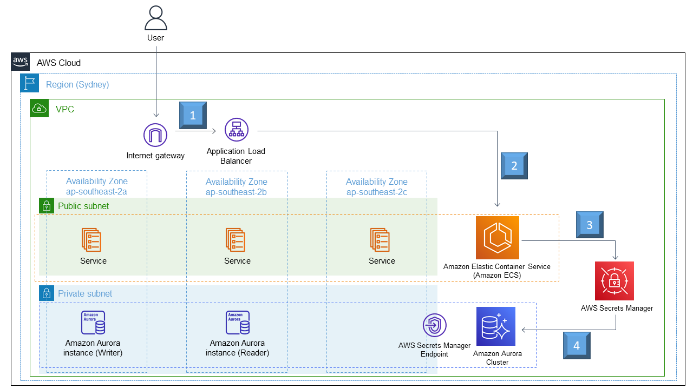

# Service Tech Challenge App Deployment Solution

All files located in this directory (solution-writeup) are associated with my attempt at solving the Servian DevOps Tech Challenge - Tech Challenge App challenge. The original Servian GitHub repository can be found here: https://github.com/servian/TechChallengeApp 

The code in this repository will deploy the Servian Go application on the Amazon Web Services (AWS) cloud.

Please read the following sections below for all assumptions made, prerequisites, changes made to the application, architectural overview and deployment instructions:

## 1.0  Assumptions Made

*   All AWS resources will be deployed in the `ap-southeast-2 (Sydney)` region.
*   All Infrastructure as Code templates follow the AWS CloudFormation syntax and are written using YAML.
*   The solution is deployed using a Linux based Operating System. If you are using a Windows based system, you will need to install either `Git for Windows` or install the `Windows Subsystem for Linux (WSL)`.
*   The website does not support encryption in transit (HTTPS) and all publicly facing traffic is unencrypted (HTTP). Encryption in transit (HTTPS) can be implemented at a later stage.
*   The website does not use SSL / TLS certificates. This can be implemented at a later stage using Amazon Route 53 (Domain Name Registration) and Amazon Certificate Manager (SSL / TLS certificate management).
*   No AWS security tools or services are used in this solution such as AWS WAF (Web Application Firewall) or Amazon CloudFront (Content Distribution Network). Both of these services can be incorporated at a later stage.
*   There are no SQL injection or Cross Site Scripting (XSS) countermeasures to protect the website or database from injection based attacks. This can be addressed by incorporating AWS WAF into future implementations.

## 2.0  Prerequisites

The following must be fulfilled to correctly deploy the solution to AWS:

*   You will need the latest version of the AWS CLI installed and configured on your computer: https://aws.amazon.com/cli/
*   You will need to have the latest version of Docker installed on your computer.
*   You will need to have an AWS account.
*   You will need to use either an AWS IAM User or Role with the following permissions to deploy the solution:

    *   **OPTION 1 - Easy Deployment**

        *   The AWS IAM User or Role has the `AdministratorAccess` policy attached to it. While this is not the most secure option (as it does not follow the principle of least privilege), there will be no permission related issues deploying the solution or uploading (pushing) Docker images to Amazon ECR. 

    *   **OPTION 2 - Principle of Least Privilege Deployment**

        *   The AWS IAM User or Role will need permissions that allow them to:

            *   Create, update, delete and describe stacks using AWS CloudFormation.
            *   Push Docker container images to Amazon ECR.
            *   Delete images in Amazon ECR (this is used when deleting the stack).

## 3.0  Changes Made to the Go Application and AWS Resources Explanation

The following section includes the additions / modifications made to the original Tech Challenge App code and explanation of the chosen AWS resources:

*   The database engine has been change from `PostgreSQL` to `Amazon Aurora PostgreSQL`. This was done as Amazon Aurora provides better performance than a native PostgreSQL database, has lower operational costs and is compatible with PostgreSQL databases.
*   The backup retention period of the RDS database is set to seven days. This can be increased or decreased based on business or compliance needs.
*   The automated backups (`BackupRetentionPeriod`) of the RDS databases will be deleted once the stack is terminated. This can be enabled at a later stage based on business or compliance needs.
*   Deletion protection (`DeletionProtection`) of the RDS databases is disabled and the databases will be destroyed if the stack is terminated. This can be enabled at a later stage based on business or compliance needs.
*   The secrets for the RDS databases (username, password and connection string) are created and stored using AWS Secrets Manager, no secrets are hardcoded in this repository.
    *   **Note: Rotation of the RDS secret was excluded from this template, as there is an issue with this template correctly configuring this functionality. This can be added and addressed in a later stage.**
*   The RDS cluster will consist of one reader and one writer RDS database for this solution. Additional reader instances can be added at a later stage.
*   Updated the listening port of the Servian Docker image from 3000 (TCP) to 80 (TCP). This was chosen to utilise an Application Load Balancer to evenly spread Internet traffic over the running ECS services / tasks and to restrict access to the publicly accessible ECS tasks using Security Groups.

## 4.0  Architectural Overview

This section includes an architectural diagram of the solution and an explanation of the flow of data:



1.  The user sends a request to access or interact with the Servian Go Application, which is served by an Application Load Balancer.
2.  The Application Load Balancer sends the request to to one of three (or more) Docker containers running on the the Amazon ECS Cluster. The containers are managed using AWS Fargate.
3.  The container will make a call to AWS Secrets Manager to get the secret credentials of the RDS cluster / databases. The secret credentials consists of the username, password, port number and connection string of the database.
4.  Using the retrieved secret credentials, the container will store or retrieve data from the database and return the result to the user (if applicable).

## 5.0  Deployment Instructions

The following section includes the commands to create, update or delete the stack associated with the Servian Tech Challenge App. The following commands assume you are in the root directory of this repository:

### 5.1 Deploying the Stack For the First Time

Using the Terminal, execute the following command:

```bash
./deploy.sh c
```

The `deploy.sh` file will perform the following actions:

1.  Compile the Go application and save the output to the `dist` directory.
2.  Deploy the first AWS CloudFormation stack `1-aws-ecr-stack.yaml` which will create an Amazon ECR to store the Docker container of the Servian Go application.
3.  Create a Docker container of the Servian Go application and push the container to Amazon ECR.
4.  Deploy the second AWS CloudFormation stack `2-aws-golang-stack.yaml` which includes the AWS resources to support the solution.
5.  Once the stack is deployed, the URL of the Application Load Balancer will be displayed on the screen which can be accessed using a web browser. An example URL is below:

    ```
    http://Servian-Tech-Challenge-ALB-1340268068.ap-southeast-2.elb.amazonaws.com
    ```

### 5.2 Updating the Stack

Using the Terminal, execute the following command:

```bash
./deploy.sh u
```

The `deploy.sh` file will perform the following actions:

1.  Compile the Go application and save the output to the `dist` directory.
2.  Create a Docker container of the Servian Go application and push the container to Amazon ECR.
3.  Update the second AWS CloudFormation stack `2-aws-golang-stack.yaml` only, the first stack `1-aws-ecr-stack.yaml` is not updated.
4.  Once the stack is deployed, the URL of the Application Load Balancer will be displayed on the screen which can be accessed using a web browser. An example URL is below:

    ```
    http://Servian-Tech-Challenge-ALB-1340268068.ap-southeast-2.elb.amazonaws.com
    ```

### 5.3 Destroying the Stack

Using the Terminal, execute the following command:

```bash
./deploy.sh d
```

The `deploy.sh` file will perform the following actions:

1.  Delete all Docker container images in the Amazon ECR that have the `latest` tag.
3.  Delete the second AWS CloudFormation stack `2-aws-golang-stack.yaml`.
4.  Delete the first AWS CloudFormation stack `1-aws-ecr-stack.yaml`.

Once the stack has been deleted, it is recommended to delete the automated RDS snapshot that is generated by the recently terminated RDS cluster.